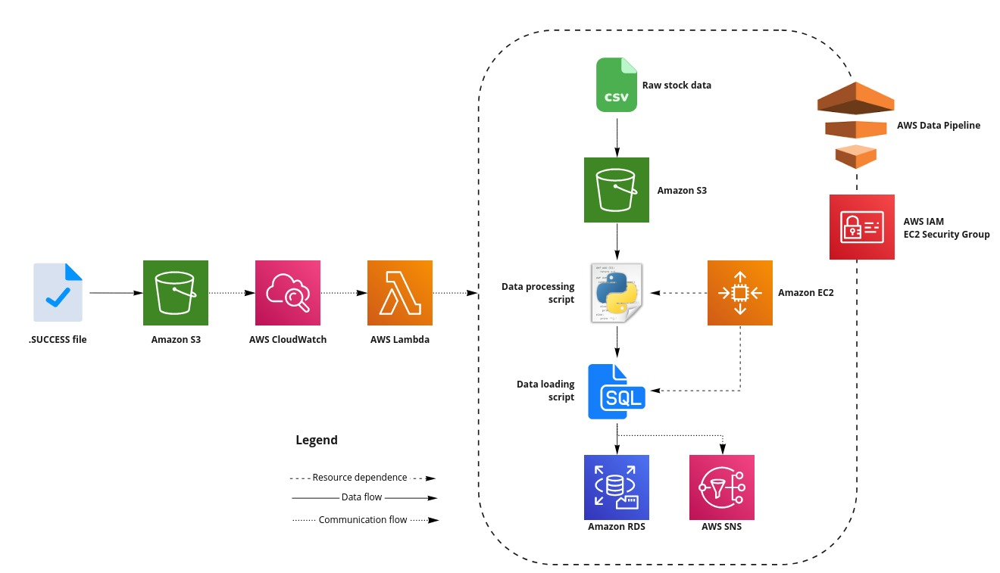

# Projects Overview

### A repository containing the scripts and files created as a part of my projects done

- ##  Intelligent Portfolio Website Creation with AWS Amplify & Comprehend
In this project, I made use of Python and AWS to create an intelligent data science portfolio website. At a high-level, the website was hosted in a serverless manner on AWS using Amplify; AWS Comprehend was used to generate a NLP solution, while AWS SES was used to send the automated responses. This NLP solution allows the website to automatically populate and send intelligent emails to interested parties based on the messages they send through the website. 

  
     
    <em>Figure 1: System Overview</em>

### **Generic Website Overview**

  

- ##  Batch Data Pipeline and Data Store Creation with AWS Data Pipeline & RDS
In this project, I used AWS  data pipeline and RDS and a host of other AWS services to create a pipeline that took in data from csv files, transformed and processed them before loading them into an RDS database. AWS Lambda was then used to automate the entire process.
The list of services used can be seen in the diagram below.

     
      
     <em>Figure 1: A representation of the completed pipeline.</em>

